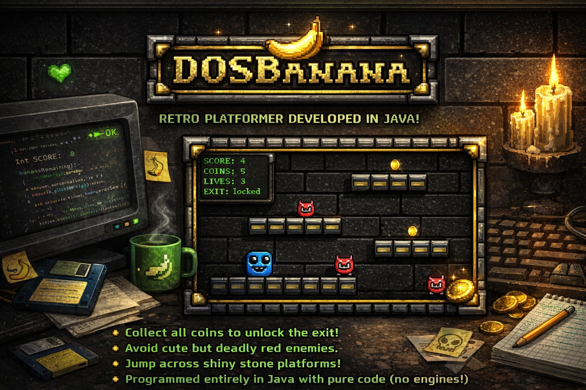

▣ DOSBanana - ##(Projekt zu lernzwecken)

Java Swing • Jump’n’Run • 1990/1991 Shareware-Vibe

DOS Banana ist ein kleines Retro-Jump’n’Run im Stil früher PC-Shareware-Games.
Sammle alle Bananen, öffne die Tür und erreiche das nächste Level – während du Gegnern ausweichst oder sie von oben „stompst“.

🎮 Gameplay

Alle Bananen sammeln → Tür öffnet sich

Gegner vermeiden oder von oben besiegen

Mehrere Level als klassische Text-Tilemaps

⌨ Controls (Default)

Move: A/D oder ←/→

Jump: SPACE / W / ↑

Restart: R (Endscreen) / ESC (Hard Reset)

Quit: Q (Endscreen)

🛠 Tech Stack

Java

Swing (2D Rendering)

Game Loop via Timer

Rendering über paintComponent(Graphics)

Tile-Collision + Bounding-Box Entity-System

Level als Textdateien (#, @, B, X, …)

🖥 Style

Klare Tiles, starke Kontraste, optionaler CRT-Look – bewusst simpel gehalten, schnell startbar, sofort spielbar.
Kein Engine-Overkill, volle Kontrolle über Timing, Physik und Kollision.
