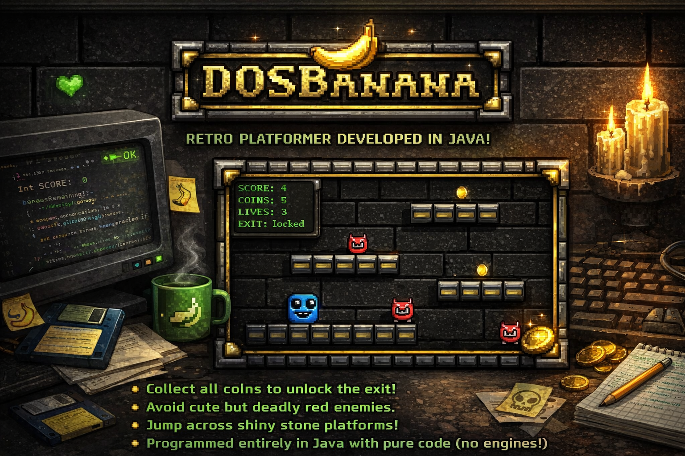

# ▣ DOS Banana

**Version 1.1.0 -- Flame & Fall Update**

> Java Swing • Jump'n'Run • 1990/1991 Shareware-Vibe\
> Ein Lernprojekt mit bewusst klassischem Aufbau.

# 🎮 Was ist DOS Banana?

**DOS Banana** ist ein kleines 2D-Retro-Jump'n'Run im Stil früher
PC-Shareware-Games der frühen 90er Jahre.

Das Projekt wurde bewusst ohne Game-Engine umgesetzt, um Rendering,
Game-Loop, Kollision, Physik und Entity-Management vollständig selbst zu
implementieren.

Es ist ein reines Java/Swing Lernprojekt, das klassische
Arcade-Mechaniken mit sauberer Struktur verbindet.

# 🚀 Features

## 🟡 Gameplay

-   Alle Bananen sammeln → Tür öffnet sich\
-   Gegner vermeiden oder von oben „stompen"\
-   Mehrere Level als klassische Text-Tilemaps

## 🔥 Version 1.1.0

-   Flame Power-Up (P) sammeln\
-   Flammen in Laufrichtung schießen (F / CTRL)\
-   Herz-System mit Half-Hearts\
-   Fallschaden bei hohen Stürzen

# ⌨ Controls

<table style="border-collapse: collapse; width: 100%; font-family: Arial, sans-serif; font-size: 14px;">
  <thead>
    <tr style="background:#111; color:#fff;">
      <th style="text-align:left; padding:10px; border:1px solid #333;">Aktion</th>
      <th style="text-align:left; padding:10px; border:1px solid #333;">Taste</th>
    </tr>
  </thead>
  <tbody>
    <tr style="background:#f7f7f7;">
      <td style="padding:10px; border:1px solid #ddd;">Bewegung</td>
      <td style="padding:10px; border:1px solid #ddd;"><code>A</code> / <code>D</code> oder <code>←</code> / <code>→</code></td>
    </tr>
    <tr style="background:#ffffff;">
      <td style="padding:10px; border:1px solid #ddd;">Springen</td>
      <td style="padding:10px; border:1px solid #ddd;"><code>SPACE</code> / <code>W</code> / <code>↑</code></td>
    </tr>
    <tr style="background:#f7f7f7;">
      <td style="padding:10px; border:1px solid #ddd;">Flammen-Schuss</td>
      <td style="padding:10px; border:1px solid #ddd;"><code>F</code> oder <code>CTRL</code></td>
    </tr>
    <tr style="background:#ffffff;">
      <td style="padding:10px; border:1px solid #ddd;">Restart</td>
      <td style="padding:10px; border:1px solid #ddd;"><code>R</code> (Endscreen) / <code>ESC</code></td>
    </tr>
    <tr style="background:#f7f7f7;">
      <td style="padding:10px; border:1px solid #ddd;">Quit</td>
      <td style="padding:10px; border:1px solid #ddd;"><code>Q</code></td>
    </tr>
  </tbody>
</table>

# 🛠 Technische Umsetzung

## Game Loop

-   javax.swing.Timer (\~60 FPS)
-   Input → Update → Kollision → Render

## Rendering

-   2D via Graphics2D
-   paintComponent()
-   Kein Framework, keine Engine

## Physik

-   Schwerkraft
-   Sprunggeschwindigkeit
-   Bounding-Box Kollision
-   Fall-Distanz Tracking

## Level-System

Textdateien mit Symbolen:

<table style="border-collapse: collapse; width: 100%; font-family: Arial, sans-serif; font-size: 14px;"> <thead> <tr style="background:#111; color:#fff;"> <th style="text-align:left; padding:10px; border:1px solid #333;">Symbol</th> <th style="text-align:left; padding:10px; border:1px solid #333;">Bedeutung</th> </tr> </thead> <tbody> <tr style="background:#f7f7f7;"> <td style="padding:10px; border:1px solid #ddd;"><code>#</code></td> <td style="padding:10px; border:1px solid #ddd;">Solid Tile</td> </tr> <tr style="background:#ffffff;"> <td style="padding:10px; border:1px solid #ddd;"><code>@</code></td> <td style="padding:10px; border:1px solid #ddd;">Player Start</td> </tr> <tr style="background:#f7f7f7;"> <td style="padding:10px; border:1px solid #ddd;"><code>B</code></td> <td style="padding:10px; border:1px solid #ddd;">Banana</td> </tr> <tr style="background:#ffffff;"> <td style="padding:10px; border:1px solid #ddd;"><code>X</code></td> <td style="padding:10px; border:1px solid #ddd;">Enemy</td> </tr> <tr style="background:#f7f7f7;"> <td style="padding:10px; border:1px solid #ddd;"><code>P</code></td> <td style="padding:10px; border:1px solid #ddd;">Flame Power-Up</td> </tr> <tr style="background:#ffffff;"> <td style="padding:10px; border:1px solid #ddd;"><code>E</code></td> <td style="padding:10px; border:1px solid #ddd;">Exit</td> </tr> </tbody> </table>

# ▶ Build & Run

<pre style="background:#0f0f0f; color:#e6e6e6; padding:14px 16px; border-radius:10px; overflow:auto; border:1px solid #2a2a2a; font-family: ui-monospace, SFMono-Regular, Menlo, Monaco, Consolas, 'Liberation Mono', 'Courier New', monospace; font-size:13px; line-height:1.5;"> @echo off setlocal enabledelayedexpansion cd /d "%~dp0" set OUT=out echo. echo [1/3] Cleaning output folder... if exist "%OUT%" rmdir /s /q "%OUT%" mkdir "%OUT%" echo. echo [2/3] Compiling... set SOURCELIST=%TEMP%\sources_dosbanana_%RANDOM%.txt if exist "%SOURCELIST%" del /q "%SOURCELIST%" for /r %%F in (*.java) do ( echo %%F&gt;&gt; "%SOURCELIST%" ) javac -encoding UTF-8 -g -d "%OUT%" @"%SOURCELIST%" if errorlevel 1 ( echo. echo [ERROR] Compilation failed. del /q "%SOURCELIST%" 2&gt;nul pause exit /b 1 ) del /q "%SOURCELIST%" 2&gt;nul echo. echo [3/3] Starting... java -cp "%OUT%" dosbanana.Game echo. pause endlocal </pre>

# 🧠 Lernziele

-   Game Loop verstehen
-   Physik implementieren
-   Collision Detection
-   Entity Lifecycle
-   Strukturierte Java-Projekte

© 2026 Marcus Dziersan\
Lernprojekt -- Java Swing Retro Game
